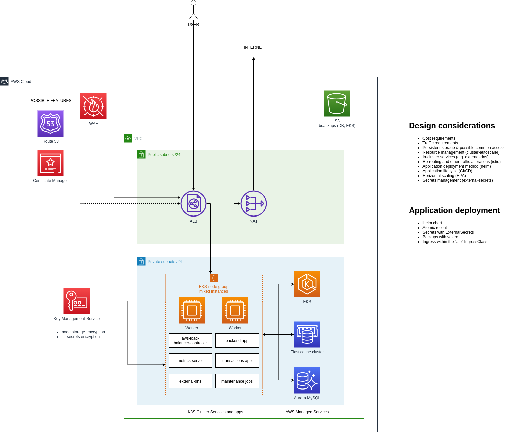

<!-- BEGIN_TF_DOCS -->

# K8s Infrastructure with cache and DB

## Overview

## Usage

* Initialize with `terraform init`.
* Create workspaces with `terraform workspace select develop || terraform workspace new develop` (or production of course).
* Run `terraform apply -var-file=environments/develop/terraform.tfvars (or production of course).

You should set up remote state, too.`

## Inputs

| Name | Description | Type | Default | Required |
|------|-------------|------|---------|:--------:|
|  [eks\_ami\_type](#input\_eks\_ami\_type) | AMI type, e.g AL2\_x86\_64 | `string` | n/a | yes |
|  [eks\_cluster\_version](#input\_eks\_cluster\_version) | Kubernetes version | `string` | n/a | yes |
|  [eks\_ebs\_iops](#input\_eks\_ebs\_iops) | EKS EBS IOPS | `number` | n/a | yes |
|  [eks\_ebs\_size](#input\_eks\_ebs\_size) | EKS EBS Disk size | `number` | n/a | yes |
|  [eks\_ebs\_throughput](#input\_eks\_ebs\_throughput) | EKS IOPS throughput | `number` | n/a | yes |
|  [eks\_ebs\_type](#input\_eks\_ebs\_type) | EKS EBS type (e.g. gp2 or gp3) | `string` | n/a | yes |
|  [eks\_instance\_types\_list](#input\_eks\_instance\_types\_list) | List of instance types for managed node group | `list(any)` | n/a | yes |
|  [eks\_primary\_group\_desired](#input\_eks\_primary\_group\_desired) | Desired instances number | `number` | n/a | yes |
|  [eks\_primary\_group\_max](#input\_eks\_primary\_group\_max) | Maximum instances number | `number` | n/a | yes |
|  [eks\_primary\_group\_min](#input\_eks\_primary\_group\_min) | Minimum instances number | `number` | n/a | yes |
|  [eks\_public\_access](#input\_eks\_public\_access) | Set to true to open EKS control plane | `bool` | n/a | yes |
|  [helm\_aws\_alb\_namespace](#input\_helm\_aws\_alb\_namespace) | Namespace for aws-load-balancer-controller | `string` | n/a | yes |
|  [helm\_aws\_alb\_replicas](#input\_helm\_aws\_alb\_replicas) | Replicas of aws-load-balancer-controller | `number` | n/a | yes |
|  [helm\_aws\_alb\_version](#input\_helm\_aws\_alb\_version) | Chart version for aws-load-balancer-controller | `string` | n/a | yes |
|  [helm\_metrics\_server\_replicas](#input\_helm\_metrics\_server\_replicas) | Replicas of metrics-server | `number` | n/a | yes |
|  [helm\_metrics\_server\_version](#input\_helm\_metrics\_server\_version) | Chart version for metrics-server | `string` | n/a | yes |
|  [name](#input\_name) | Project name | `string` | n/a | yes |
|  [redis\_node\_type](#input\_redis\_node\_type) | Redis instances type | `string` | n/a | yes |
|  [redis\_nodes\_num](#input\_redis\_nodes\_num) | Redis instances number | `number` | n/a | yes |
|  [region](#input\_region) | AWS region | `string` | n/a | yes |
|  [vpc\_cidr](#input\_vpc\_cidr) | VPC CIDR | `string` | n/a | yes |
|  [vpc\_enable\_nat](#input\_vpc\_enable\_nat) | Set to true to use NAT | `bool` | n/a | yes |
|  [vpc\_flowlogs](#input\_vpc\_flowlogs) | Set to true to keep VPC flowlogs | `bool` | n/a | yes |
|  [vpc\_private\_subnet\_cidrs\_list](#input\_vpc\_private\_subnet\_cidrs\_list) | The list of three CIDRs | `list(any)` | n/a | yes |
|  [vpc\_public\_subnet\_cidrs\_list](#input\_vpc\_public\_subnet\_cidrs\_list) | The list of three CIDRs | `list(any)` | n/a | yes |
|  [vpc\_single\_nat](#input\_vpc\_single\_nat) | Set to true to configure single NAT for all AZs | `bool` | n/a | yes |

## Outputs

No outputs.

Disclaimer: this code is auto-generated by [tf-docs](https://terraform-docs.io)

[Return](../README.md)
<!-- END_TF_DOCS -->